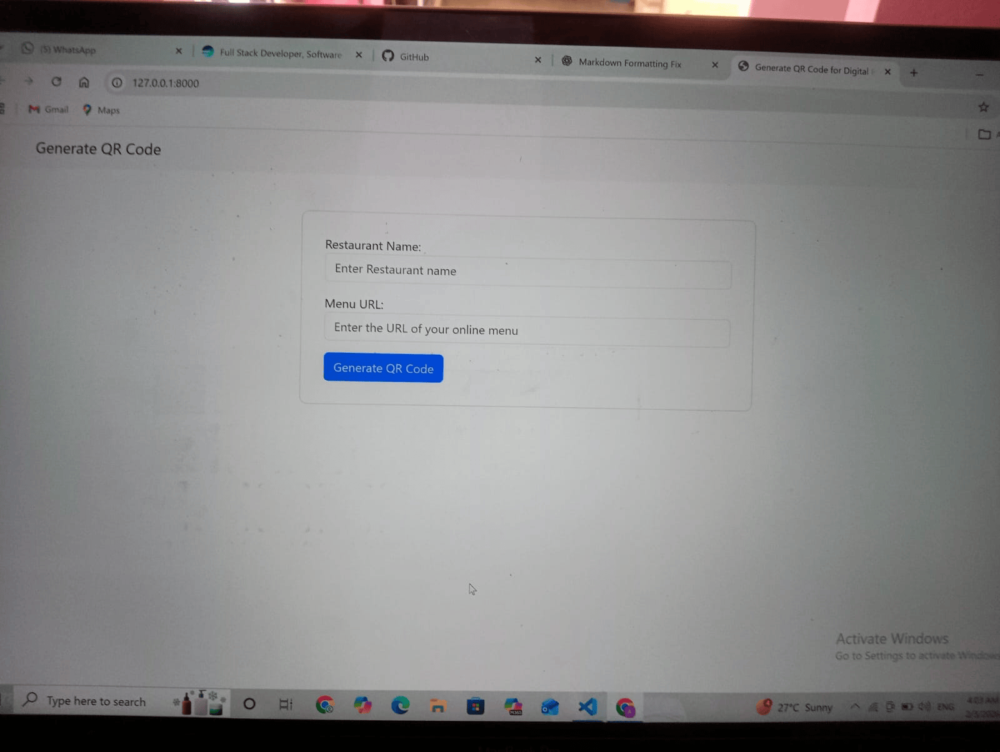
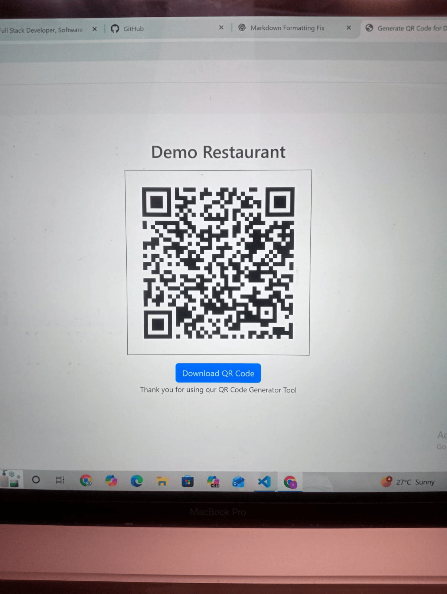

# MenuQR 🍽️📱

MenuQR is a Django-based web application that allows restaurants to generate **QR codes from their menu URLs**. The generated QR code can be **previewed and downloaded**, helping restaurants provide contactless digital menus.

---

## ✨ Features

- 🔗 Generate QR codes from restaurant menu URLs  
- 👀 Preview QR code instantly  
- 📥 Download QR code as an image  
- 🏪 Useful for restaurants, cafés, and food outlets  
- ⚡ Simple and lightweight Django application  

---

## 🛠 Tech Stack

- Python  
- Django  
- qrcode  
- Pillow  
- HTML, CSS, Bootstrap  

---

## 🚀 Setup Instructions

Follow the steps below to run the project locally.

### 1️⃣ Clone the Repository

```bash
git clone https://github.com/ashreyasureddy/MenuQR.git
cd MenuQR
```

### 2️⃣ Create a Virtual Environment

```bash
python -m venv env
```

### 3️⃣ Activate the Virtual Environment

**Windows**
```bash
env\Scripts\activate
```

**macOS / Linux**
```bash
source env/bin/activate
```

### 4️⃣ Install Dependencies

```bash
pip install django qrcode pillow
```

### 5️⃣ Run Database Migrations

```bash
python manage.py migrate
```

### 6️⃣ Start the Development Server

```bash
python manage.py runserver
```

Open your browser and visit:

```text
http://127.0.0.1:8000/
```

---


## 🧑‍🍳 How to Use

1. Open the application in your browser  
2. Enter the **restaurant name**  
3. Enter the **menu URL**  
4. Click **Generate QR Code**  
5. Preview the generated QR code  
6. Click **Download QR Code** to save the image  

---

## 📂 Project Structure

```bash
MenuQR/
├── django_qr/                     # Main Django app
│   ├── migrations/
│   ├── __init__.py
│   ├── admin.py
│   ├── apps.py
│   ├── forms.py
│   ├── models.py
│   ├── tests.py
│   ├── urls.py
│   ├── views.py
│   └── templates/                 # HTML templates
│       └── django_qr/
│           ├── generate_qr_code.html
│           └── qr_result.html
│
├── media/                         # contains demo menu images and generated QR code images
│   ├── demo_restaurant_menu.png
│   └── paradise_restaurant_menu.png
│
├── screenshots/                   # README screenshots
│   ├── home.png
│   └── qr_result.png
│
├── db.sqlite3
├── manage.py
├── requirements.txt
├── README.md
└── LICENSE

```
## ℹ️ Notes

> **Note:**  
> The `media/` directory is used to store runtime-generated files such as QR code images.  
> It is excluded from version control via `.gitignore` and is created automatically when the app runs.  
>  
> Demo screenshots shown above are stored in the `screenshots/` directory, not in `media/`.

---

## 📸 Screenshots

### Home Page


### Generated QR Code


---

## 🧪 Example

Sample menu URL:

```text
https://drive.google.com/file/d/1i63ZJi5LKJSWP6zniCnkbstCNId8x_d_/view
```

---

## 🛣️ Future Enhancements

- 🎨 Custom QR colors and logos
- 📊 QR scan analytics
- 👤 User authentication
- 🌍 Multi-language support

---

## 📄 License

This project is licensed under the MIT License.

---


